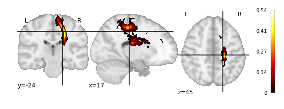

======================
Exploring the atlases
======================

There are four different atlas types in ConWhat, corresponding to the 2
ontology types (Tract-based / Connectivity-Based) and 2 representation
types (Volumetric / Streamlinetric).

(More on this schema
`here <http://conwhat.readthedocs.io/en/latest/about_conwhat/ontology_and_representation.html>`__)

.. code-block:: python

    >>> # ConWhAt stuff
    >>> from conwhat import VolConnAtlas,StreamConnAtlas,VolTractAtlas,StreamTractAtlas
    >>> from conwhat.viz.volume import plot_vol_scatter
    
    >>> # Neuroimaging stuff
    >>> import nibabel as nib
    >>> from nilearn.plotting import plot_stat_map,plot_surf_roi
    
    >>> # Viz stuff
    >>> %matplotlib inline
    >>> from matplotlib import pyplot as plt
    >>> import seaborn as sns
    
    >>> # Generic stuff
    >>> import glob, numpy as np, pandas as pd, networkx as nx

We'll start with the scale 33 lausanne 2008 volumetric
connectivity-based atlas.

Define the atlas name and top-level directory location

.. code-block:: python

    >>> atlas_dir = '/scratch/hpc3230/Data/conwhat_atlases'
    >>> atlas_name = 'CWL2k8Sc33Vol3d100s_v01'  

Initialize the atlas class

.. code-block:: python

    >>> vca = VolConnAtlas(atlas_dir=atlas_dir + '/' + atlas_name,
                            atlas_name=atlas_name)

    loading file mapping
    loading vol bbox
    loading connectivity

This atlas object contains various pieces of general information

.. code-block:: python

    >>> vca.atlas_name
    
    'CWL2k8Sc33Vol3d100s_v01'

.. code-block:: python

    >>> vca.atlas_dir

    '/scratch/hpc3230/Data/conwhat_atlases/CWL2k8Sc33Vol3d100s_v01'

Information about each atlas entry is contained in the ``vfms``
attribute, which returns a pandas dataframe

Additionally, connectivity-based atlases also contain a ``networkx``
graph object ``vca.Gnx``, which contains information about each
connectome edge

.. code-block:: python

    >>> vca.Gnx.edges[(10,35)]

    {'attr_dict': {'4dvolind': nan,
      'fullname': 'L_paracentral_to_L_caudate',
      'idx': 1637,
      'name': '10_to_35',
      'nii_file': 'vismap_grp_11-36_norm.nii.gz',
      'nii_file_id': 1637,
      'weight': 50.240000000000002,
      'xmax': 92,
      'xmin': 61,
      'ymax': 167,
      'ymin': 75,
      'zmax': 92,
      'zmin': 62}}

Individual atlas entry nifti images can be grabbed like so

.. code-block:: python

    >>> img = vca.get_vol_from_vfm(1637)

    getting atlas entry 1637: image file /scratch/hpc3230/Data/conwhat_atlases/CWL2k8Sc33Vol3d100s_v01/vismap_grp_11-36_norm.nii.gz

.. code-block:: python

    >>> plot_stat_map(img)

Or alternatively as a 3D scatter plot, along with the x,y,z bounding box

.. code-block:: python

    >>> vca.bbox.ix[1637]

    xmin     61
    xmax     92
    ymin     75
    ymax    167
    zmin     62
    zmax     92
    Name: 1637, dtype: int64

.. code-block:: python

    >>> ax = plot_vol_scatter(vca.get_vol_from_vfm(1),c='r',bg_img='nilearn_destrieux',
    >>>                         bg_params={'s': 0.1, 'c':'k'},figsize=(20, 15))
    >>> ax.set_xlim([0,200]); ax.set_ylim([0,200]); ax.set_zlim([0,200]);

    getting atlas entry 1: image file /scratch/hpc3230/Data/conwhat_atlases/CWL2k8Sc33Vol3d100s_v01/vismap_grp_39-56_norm.nii.gz

.. image:: ../figs/scatter_view.png

We can also view the weights matrix like so:

.. code:: ipython2

    >>> fig, ax = plt.subplots(figsize=(16,12))
    >>> sns.heatmap(np.log1p(vca.weights),xticklabels=vca.region_labels,
    >>>               yticklabels=vca.region_labels,ax=ax);
    >>> plt.tight_layout()

.. image:: ../figs/weights_matrix.png

The ``vca`` object also contains x,y,z bounding boxes for each structure

We also stored additional useful information about the ROIs in the
associated parcellation, including cortical/subcortical labels

.. code-block:: python

    >>> vca.cortex

    array([ 1.,  1.,  1.,  1.,  1.,  1.,  1.,  1.,  1.,  1.,  1.,  1.,  1.,
            1.,  1.,  1.,  1.,  1.,  1.,  1.,  1.,  1.,  1.,  1.,  1.,  1.,
            1.,  1.,  1.,  1.,  1.,  1.,  1.,  1.,  0.,  0.,  0.,  0.,  0.,
            0.,  0.,  0.,  1.,  1.,  1.,  1.,  1.,  1.,  1.,  1.,  1.,  1.,
            1.,  1.,  1.,  1.,  1.,  1.,  1.,  1.,  1.,  1.,  1.,  1.,  1.,
            1.,  1.,  1.,  1.,  1.,  1.,  1.,  1.,  1.,  1.,  1.,  0.,  0.,
            0.,  0.,  0.,  0.,  0.])

...hemisphere labels

.. code-block:: python

    >>> vca.hemispheres

    array([ 1.,  1.,  1.,  1.,  1.,  1.,  1.,  1.,  1.,  1.,  1.,  1.,  1.,
            1.,  1.,  1.,  1.,  1.,  1.,  1.,  1.,  1.,  1.,  1.,  1.,  1.,
            1.,  1.,  1.,  1.,  1.,  1.,  1.,  1.,  1.,  1.,  1.,  1.,  1.,
            1.,  1.,  1.,  0.,  0.,  0.,  0.,  0.,  0.,  0.,  0.,  0.,  0.,
            0.,  0.,  0.,  0.,  0.,  0.,  0.,  0.,  0.,  0.,  0.,  0.,  0.,
            0.,  0.,  0.,  0.,  0.,  0.,  0.,  0.,  0.,  0.,  0.,  0.,  0.,
            0.,  0.,  0.,  0.,  0.])

...and region mappings to freesurfer's fsaverage brain

.. code-block:: python

    >>> vca.region_mapping_fsav_lh

    array([ 24.,  29.,  28., ...,  16.,   7.,   7.])

.. code-block:: python

    >>> vca.region_mapping_fsav_rh

    array([ 24.,  29.,  22., ...,   9.,   9.,   9.])

which can be used for, e.g. plotting ROI data on a surface

.. code-block:: python

    >>> f = '/opt/freesurfer/freesurfer/subjects/fsaverage/surf/lh.inflated'
    >>> vtx,tri = nib.freesurfer.read_geometry(f)
    >>> plot_surf_roi([vtx,tri],vca.region_mapping_fsav_lh);

.. image:: ../figs/rois_on_surf.png

