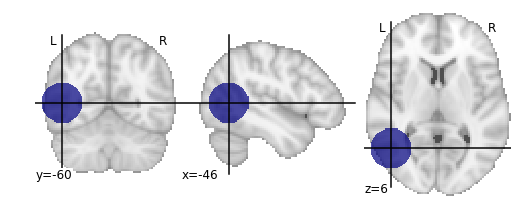
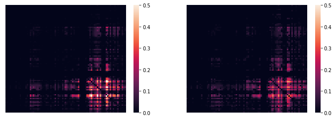
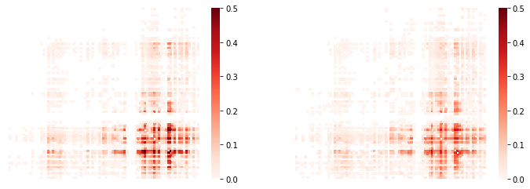
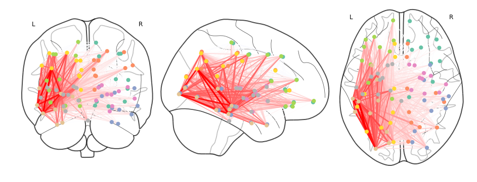

Compute lesion overlap
======================

.. code:: 

    # ConWhAt stuff
    from conwhat import VolConnAtlas,StreamConnAtlas,VolTractAtlas,StreamTractAtlas
    from conwhat.viz.volume import plot_vol_scatter
    
    # Neuroimaging stuff
    import nibabel as nib
    from nilearn.plotting import (plot_stat_map,plot_surf_roi,plot_roi,
                                 plot_connectome,find_xyz_cut_coords)
    from nilearn.image import resample_to_img
    
    # Viz stuff
    %matplotlib inline
    from matplotlib import pyplot as plt
    import seaborn as sns
    
    # Generic stuff
    import glob, numpy as np, pandas as pd, networkx as nx
    from datetime import datetime

We now use the synthetic lesion constructed in the previous example in a
ConWhAt lesion analysis.

.. code:: 

    lesion_file = 'synthetic_lesion_20mm_sphere_-46_-60_6.nii.gz' # we created this file from scratch in the previous example

Take another quick look at this mask:

.. code:: 

    lesion_img = nib.load(lesion_file)
    plot_roi(lesion_file);

Since our lesion mask does not (by construction) have a huge amount of
spatial detail, it makes sense to use one of the lower-resolution atlas.
As one might expect, computation time is considerably faster for
lower-resolution atlases.

.. code:: 

    cw_atlases_dir = '/global/scratch/hpc3230/Data/conwhat_atlases'  # change this accordingly
    atlas_name = 'CWL2k8Sc33Vol3d100s_v01'
    atlas_dir = '%s/%s' %(cw_atlases_dir, atlas_name)

See the previous tutorial on 'exploring the conwhat atlases' for more
info on how to examine the components of a given atlas in *ConWhAt*.

Initialize the atlas

.. code:: 

    cw_vca = VolConnAtlas(atlas_dir=atlas_dir)

.. parsed-literal::

    loading file mapping
    loading vol bbox
    loading connectivity

``cw_vca.vfms``

Choose which connections to evaluate.

This is normally an array of numbers indexing entries in
``cw_vca.vfms``.

Pre-defining connection subsets is a useful way of speeding up large
analyses, especially if one is only interested in connections between
specific sets of regions.

As we are using a relatively small atlas, and our lesion is not too
extensive, we can assess all connections.

.. code:: 

    idxs = 'all' # alternatively, something like: range(1,100), indicates the first 100 cnxns (rows in .vmfs)

Now, compute lesion overlap statistics.

.. code:: 

    jlc_dir = '/global/scratch/hpc3230/joblib_cache_dir' # this is the cache dir where joblib writes temporary files
    lo_df,lo_nx = cw_vca.compute_hit_stats(lesion_file,idxs,n_jobs=4,joblib_cache_dir=jlc_dir)

.. parsed-literal::

    computing hit stats for roi synthetic_lesion_20mm_sphere_-46_-60_6.nii.gz

This takes about 20 minutes to run.

``vca.compute_hit_stats()`` returns a ``pandas`` dataframe, ``lo_df``,
and a ``networkx`` object, ``lo_nx``.

Both contain mostly the same information, which is sometimes more useful
in one of these formats and sometimes in the other.

``lo_df`` is a table, with rows corresponding to each connection, and
columns for each of a wide set of `statistical
metrics <https://en.wikipedia.org/wiki/Sensitivity_and_specificity>`__
for evaluating sensitivity and specificity of binary hit/miss data:

.. code:: 

    lo_df.head()

.. raw:: html

    

    
    <table border="1" class="dataframe">
      <thead>
        <tr style="text-align: right;">
          <th>metric</th>
          <th>ACC</th>
          <th>BM</th>
          <th>F1</th>
          <th>FDR</th>
          <th>FN</th>
          <th>FNR</th>
          <th>FP</th>
          <th>FPR</th>
          <th>Kappa</th>
          <th>MCC</th>
          <th>MK</th>
          <th>NPV</th>
          <th>PPV</th>
          <th>TN</th>
          <th>TNR</th>
          <th>TP</th>
          <th>TPR</th>
          <th>corr_nothr</th>
          <th>corr_thr</th>
          <th>corr_thrbin</th>
        </tr>
        <tr>
          <th>idx</th>
          <th></th>
          <th></th>
          <th></th>
          <th></th>
          <th></th>
          <th></th>
          <th></th>
          <th></th>
          <th></th>
          <th></th>
          <th></th>
          <th></th>
          <th></th>
          <th></th>
          <th></th>
          <th></th>
          <th></th>
          <th></th>
          <th></th>
          <th></th>
        </tr>
      </thead>
      <tbody>
        <tr>
          <th>0</th>
          <td>0.990646</td>
          <td>0.104859</td>
          <td>0.098135</td>
          <td>0.911501</td>
          <td>29696.0</td>
          <td>0.889874</td>
          <td>37851.0</td>
          <td>0.005266</td>
          <td>0.330534</td>
          <td>0.094054</td>
          <td>0.084363</td>
          <td>0.995864</td>
          <td>0.088499</td>
          <td>7149810.0</td>
          <td>0.994734</td>
          <td>3675.0</td>
          <td>0.110126</td>
          <td>0.042205</td>
          <td>0.042205</td>
          <td>0.094054</td>
        </tr>
        <tr>
          <th>3</th>
          <td>0.987324</td>
          <td>0.011683</td>
          <td>0.014279</td>
          <td>0.988855</td>
          <td>32708.0</td>
          <td>0.980132</td>
          <td>58828.0</td>
          <td>0.008185</td>
          <td>0.329134</td>
          <td>0.008766</td>
          <td>0.006577</td>
          <td>0.995433</td>
          <td>0.011145</td>
          <td>7128833.0</td>
          <td>0.991815</td>
          <td>663.0</td>
          <td>0.019868</td>
          <td>-0.001487</td>
          <td>-0.001487</td>
          <td>0.008766</td>
        </tr>
        <tr>
          <th>7</th>
          <td>0.987160</td>
          <td>-0.006617</td>
          <td>0.001185</td>
          <td>0.999075</td>
          <td>33316.0</td>
          <td>0.998352</td>
          <td>59404.0</td>
          <td>0.008265</td>
          <td>0.329023</td>
          <td>-0.004966</td>
          <td>-0.003727</td>
          <td>0.995348</td>
          <td>0.000925</td>
          <td>7128257.0</td>
          <td>0.991735</td>
          <td>55.0</td>
          <td>0.001648</td>
          <td>-0.003549</td>
          <td>-0.003549</td>
          <td>-0.004966</td>
        </tr>
        <tr>
          <th>10</th>
          <td>0.994367</td>
          <td>-0.000926</td>
          <td>0.000147</td>
          <td>0.999589</td>
          <td>33368.0</td>
          <td>0.999910</td>
          <td>7305.0</td>
          <td>0.001016</td>
          <td>0.331450</td>
          <td>-0.001976</td>
          <td>-0.004215</td>
          <td>0.995374</td>
          <td>0.000411</td>
          <td>7180356.0</td>
          <td>0.998984</td>
          <td>3.0</td>
          <td>0.000090</td>
          <td>-0.001975</td>
          <td>-0.001975</td>
          <td>-0.001976</td>
        </tr>
        <tr>
          <th>11</th>
          <td>0.989105</td>
          <td>0.048907</td>
          <td>0.044941</td>
          <td>0.962227</td>
          <td>31520.0</td>
          <td>0.944533</td>
          <td>47152.0</td>
          <td>0.006560</td>
          <td>0.329846</td>
          <td>0.040403</td>
          <td>0.033378</td>
          <td>0.995605</td>
          <td>0.037773</td>
          <td>7140509.0</td>
          <td>0.993440</td>
          <td>1851.0</td>
          <td>0.055467</td>
          <td>0.017664</td>
          <td>0.017664</td>
          <td>0.040403</td>
        </tr>
      </tbody>
    </table>
    

Typically we will be mainly interested in two of these metric scores:

``TPR`` - True positive (i.e. hit) rate: number of true positives,
divided by number of true positives + number of false negatives

``corr_thrbin`` - Pearson correlation between the lesion amge and the
thresholded, binarized connectome edge image (group-level visitation
map)

.. code:: 

    lo_df[['TPR', 'corr_thrbin']].iloc[:10].T

.. raw:: html

    

    
    <table border="1" class="dataframe">
      <thead>
        <tr style="text-align: right;">
          <th>idx</th>
          <th>0</th>
          <th>3</th>
          <th>7</th>
          <th>10</th>
          <th>11</th>
          <th>13</th>
          <th>14</th>
          <th>15</th>
          <th>18</th>
          <th>19</th>
        </tr>
        <tr>
          <th>metric</th>
          <th></th>
          <th></th>
          <th></th>
          <th></th>
          <th></th>
          <th></th>
          <th></th>
          <th></th>
          <th></th>
          <th></th>
        </tr>
      </thead>
      <tbody>
        <tr>
          <th>TPR</th>
          <td>0.110126</td>
          <td>0.019868</td>
          <td>0.001648</td>
          <td>0.000090</td>
          <td>0.055467</td>
          <td>0.002128</td>
          <td>0.000569</td>
          <td>0.000000</td>
          <td>0.098469</td>
          <td>0.023523</td>
        </tr>
        <tr>
          <th>corr_thrbin</th>
          <td>0.094054</td>
          <td>0.008766</td>
          <td>-0.004966</td>
          <td>-0.001976</td>
          <td>0.040403</td>
          <td>0.005801</td>
          <td>0.000641</td>
          <td>-0.002543</td>
          <td>0.169234</td>
          <td>0.029414</td>
        </tr>
      </tbody>
    </table>
    

We can obtain these numbers as a 'modification matrix' (connectivity
matrix)

.. code:: 

    tpr_adj = nx.to_pandas_adjacency(lo_nx,weight='TPR')
    cpr_adj = nx.to_pandas_adjacency(lo_nx,weight='corr_thrbin')

These two maps are, unsurprisingly, very similar:

.. code:: 

    np.corrcoef(tpr_adj.values.ravel(), cpr_adj.values.ravel())

.. parsed-literal::

    array([[1.        , 0.96271946],
           [0.96271946, 1.        ]])

.. code:: 

    fig, ax = plt.subplots(ncols=2, figsize=(12,4))
    
    sns.heatmap(tpr_adj,xticklabels='',yticklabels='',vmin=0,vmax=0.5,ax=ax[0]);
    
    sns.heatmap(cpr_adj,xticklabels='',yticklabels='',vmin=0,vmax=0.5,ax=ax[1]);

(...with an alternative color scheme...)

.. code:: 

    fig, ax = plt.subplots(ncols=2, figsize=(12,4))
    
    sns.heatmap(tpr_adj, xticklabels='',yticklabels='',cmap='Reds',
                       mask=tpr_adj.values==0,vmin=0,vmax=0.5,ax=ax[0]);
    
    sns.heatmap(cpr_adj,xticklabels='',yticklabels='',cmap='Reds',
                       mask=cpr_adj.values==0,vmin=0,vmax=0.5,ax=ax[1]);

We can list directly the most affected (greatest % overlap) connections,

.. code:: 

    cw_vca.vfms.loc[lo_df.index].head()

.. raw:: html

    

    
    <table border="1" class="dataframe">
      <thead>
        <tr style="text-align: right;">
          <th></th>
          <th>name</th>
          <th>nii_file</th>
          <th>nii_file_id</th>
          <th>4dvolind</th>
        </tr>
        <tr>
          <th>idx</th>
          <th></th>
          <th></th>
          <th></th>
          <th></th>
        </tr>
      </thead>
      <tbody>
        <tr>
          <th>0</th>
          <td>61_to_80</td>
          <td>vismap_grp_62-81_norm.nii.gz</td>
          <td>0</td>
          <td>NaN</td>
        </tr>
        <tr>
          <th>3</th>
          <td>18_to_19</td>
          <td>vismap_grp_19-20_norm.nii.gz</td>
          <td>3</td>
          <td>NaN</td>
        </tr>
        <tr>
          <th>7</th>
          <td>45_to_48</td>
          <td>vismap_grp_46-49_norm.nii.gz</td>
          <td>7</td>
          <td>NaN</td>
        </tr>
        <tr>
          <th>10</th>
          <td>19_to_68</td>
          <td>vismap_grp_20-69_norm.nii.gz</td>
          <td>10</td>
          <td>NaN</td>
        </tr>
        <tr>
          <th>11</th>
          <td>21_to_61</td>
          <td>vismap_grp_22-62_norm.nii.gz</td>
          <td>11</td>
          <td>NaN</td>
        </tr>
      </tbody>
    </table>
    

To plot the modification matrix information on a brain, we first need to
some spatial locations to plot as nodes. For these, we calculate (an
approprixation to) each atlas region's centriod location:

.. code:: 

    parc_img = cw_vca.region_nii
    parc_dat = parc_img.get_data()
    parc_vals = np.unique(parc_dat)[1:]
    
    ccs = {roival: find_xyz_cut_coords(nib.Nifti1Image((dat==roival).astype(int),img.affine),
                                       activation_threshold=0) for roival in roivals}
    ccs_arr = np.array(ccs.values())

Now plotting on a glass brain:

.. code:: 

    fig, ax = plt.subplots(figsize=(16,6))
    plot_connectome(tpr_adj.values,ccs_arr,axes=ax,edge_threshold=0.2,colorbar=True,
                        edge_cmap='Reds',edge_vmin=0,edge_vmax=1.,
                        node_color='lightgrey',node_kwargs={'alpha': 0.4});
    #edge_vmin=0,edge_vmax=1)

::

    ---------------------------------------------------------------------------

    NameError                                 Traceback (most recent call last)

    <ipython-input-1-0477afc1d74b> in <module>()
    ----> 1 fig, ax = plt.subplots(figsize=(16,6))
          2 plot_connectome(tpr_adj.values,ccs_arr,axes=ax,edge_threshold=0.2,colorbar=True,
          3                     edge_cmap='Reds',edge_vmin=0,edge_vmax=1.,
          4                     node_color='lightgrey',node_kwargs={'alpha': 0.4});
          5 #edge_vmin=0,edge_vmax=1)

    NameError: name 'plt' is not defined

.. code:: 

    fig, ax = plt.subplots(figsize=(16,6))
    plot_connectome(cpr_adj.values,ccs_arr,axes=ax)

.. parsed-literal::

    <nilearn.plotting.displays.OrthoProjector at 0x7f454cea5b90>

