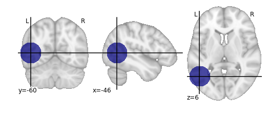

Defining a Lesion
=================

Conducting a lesion analysis in ConWhAt is extremely simple. All that is
needed is a binary ``.nii`` format lesion mask, with ones indicating
lesioned tissue, and zeros elsewhere.

    (Note: we terms like 'lesion' and 'damage' throughout most of this
    documentation, as that is the most natural primary context for
    ConWhAt analyses. Remember however that all we are doing at the end
    of the day is doing a set of look-up operations between a list of
    standard space coordinates on the one hand (as defined by non-zero
    values in a ``.nii`` image), and the spatial locations of each
    'connectome edge' - i.e. each entry in our anatomical connectivity
    matrix. One can envisave many alternative
    interpretations/applications of this procedure; for example to map
    the connectivity effects of magnetic field or current distributions
    from nonivasive brain stimulation). Still, for concreteness and
    simplicity, we stick with 'lesion', 'damage', etc. for the most
    part. )

A common way to obtain a lesion map is to from a patient's T1-weighted
MR image. Although this can be done manually, it is strongly recommended
to use an automated lesion segmentation tools, followed by manual
editing.

An alternative way is simply to define a lesion location using standard
space coordinates, and build a 'lesion' mask *de-novo*. This is what we
do in the following example. On the next page we do a ConWhAt
connectome-based decomposition analysis on this 'synthetic' lesion mask.

--------------

.. code:: ipython2

    # ConWhAt stuff
    from conwhat import VolConnAtlas,StreamConnAtlas,VolTractAtlas,StreamTractAtlas
    from conwhat.viz.volume import plot_vol_and_rois_nilearn
    
    # Neuroimaging stuff
    import nibabel as nib
    from nilearn.plotting import plot_roi
    from nipy.labs.spatial_models.mroi import subdomain_from_balls
    from nipy.labs.spatial_models.discrete_domain import grid_domain_from_image
    
    # Viz stuff
    %matplotlib inline
    from matplotlib import pyplot as plt
    
    # Generic stuff
    import numpy as np

Define some variables

.. code:: ipython2

    # Locate the standard space template image
    fsl_dir = '/global/software/fsl/5.0.10'
    t1_mni_file = fsl_dir + '/data/standard/MNI152_T1_1mm_brain.nii.gz'
    t1_mni_img = nib.load(t1_mni_file)
    
    # This is the output we will save to file and use in the next example
    lesion_file = 'synthetic_lesion_20mm_sphere_-46_-60_6.nii.gz'

Define the 'synthetic lesion' location and size using standard (MNI)
space coordinates

.. code:: ipython2

    com = [-46,-60,6] # com = centre of mass
    rad = 20             # radius

Create the ROI

.. code:: ipython2

    domain = grid_domain_from_image(t1_mni_img)
    lesion_img = subdomain_from_balls(domain,np.array([com]), np.array([rad])).to_image()

Plot on brain slices

.. code:: ipython2

    plot_roi(lesion_img,bg_img=t1_mni_img,black_bg=False);

Save to file

.. code:: ipython2

    lesion_img.to_filename(lesion_file)

...now we move on to doing a lesion analysis with this file.
